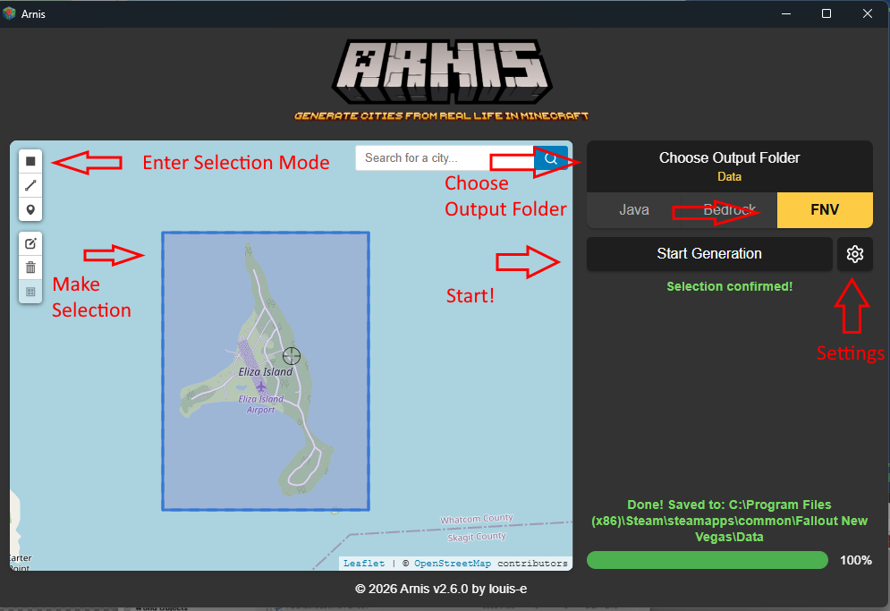
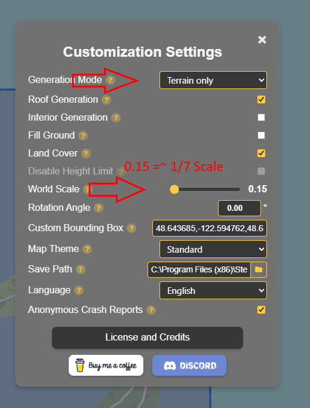
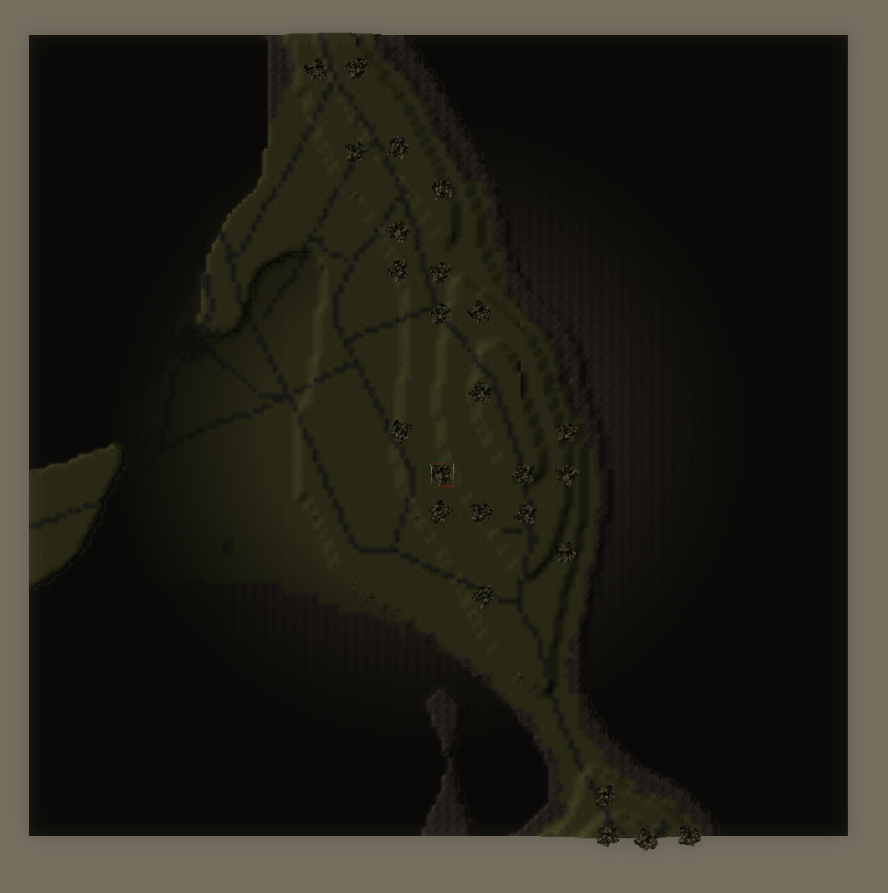

Arnis Support for Fallout: New Vegas
------------------------------------
Arnis is a compelling tool that generates maps for Minecraft using geo-spatial data from the real world.
With this fork, Arnis can output maps in .esm format, compatible with Fallout: NEw Vegas (and, presumably, Fallout 3).

Note: This is a very early prototype with limited support for the following:
- Elevation
- Water height
- Textures

Consider this a "quick start" for making your map, not a 100% solution. If possible, I'll expand on this in the future.

1. Enter Selection Mode
1. Make your selection
    1. Note, large areas may not work. Think cities, not counties.
1. Choose your output folder
1. Select output format: FNV
1. Open Settings...

1. Select Terrain Only (buildings/roads not yet supported)
1. Select scale.
    1. 0.15 is roughly 1/7 scale, which was used in building Fallout New Vegas.
1. Exit settings and click Start Generation

Sample output from generating Eliza Island. Not perfect, but a good start.
