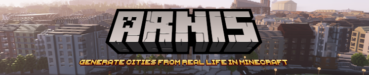
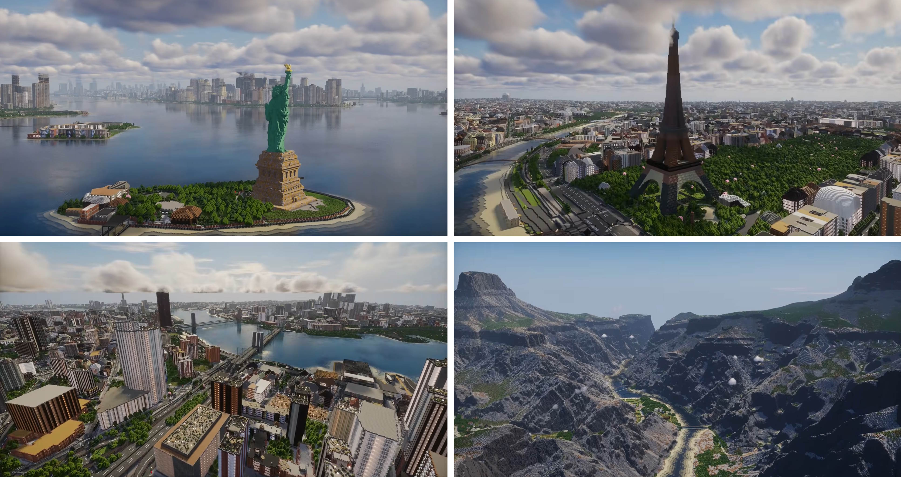
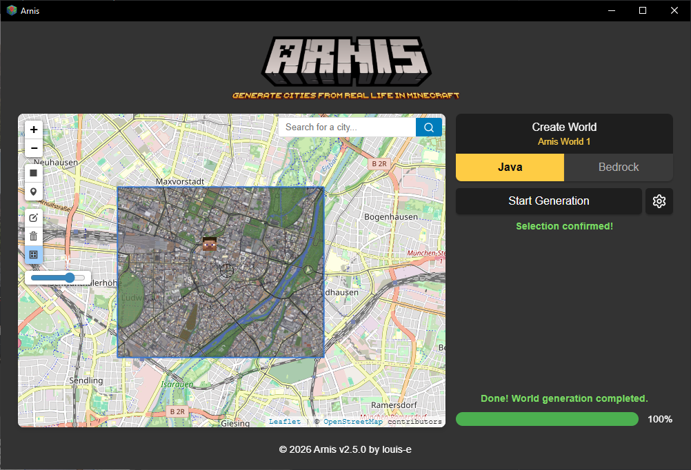

<!-- README-I18N:START -->

[English](./README.md) | **汉语**

<!-- README-I18N:END -->

# Arnis [](https://github.com/louis-e/arnis/actions) [](https://github.com/louis-e/arnis/releases) [](https://github.com/louis-e/arnis/releases) [](https://github.com/louis-e/arnis/releases) [](https://discord.gg/mA2g69Fhxq)

Arnis 可以创建复杂且精准的 Minecraft Java 版（1.17+）和基岩版世界，真实反映现实世界的地理、地形和建筑。

这个免费开源项目旨在处理来自现实世界的大规模地理数据并生成详细的 Minecraft 世界。该算法处理来自 OpenStreetMap 的地理空间数据以及高程数据，以创建地形和建筑的精准 Minecraft 呈现。轻松生成你的家乡、大城市和自然景观！

_**想要移动端生成或更大的地图尺寸？** [MapSmith](https://arnismc.com/mapsmith/) 可在浏览器中生成世界，无需安装。_


<i>本 GitHub 页面和 [arnismc.com](https://arnismc.com) 是唯一官方项目网站。请勿从任何其他网站下载 Arnis。</i>

## :keyboard: 使用方法
<br>
下载[最新版本](https://github.com/louis-e/arnis/releases/)或自行[编译](#trophy-开源)。

使用矩形工具在地图上选择你的区域，然后选择你的 Minecraft 世界 - 接着只需点击<i>开始生成</i>！
此外，你可以自定义各种生成设置，例如世界缩放比例、出生点或建筑内部生成。

## 📚 文档


完整的文档可在 [GitHub Wiki](https://github.com/louis-e/arnis/wiki/) 中找到，涵盖技术说明、常见问题、贡献指南和路线图等主题。

[backgroundvid.webm](https://github.com/user-attachments/assets/420acc19-a850-418e-8397-1a45b05582ab)

## :trophy: 开源
#### 本项目的主要目标
- **模块化**：确保所有组件（如数据获取、处理和世界生成）清晰分离为独立模块，以便更好地维护和扩展。
- **性能优化**：我们致力于保持强劲的性能和快速的世界生成。
- **全面的文档**：详细的代码内文档，提供清晰的结构和逻辑。
- **用户友好的体验**：专注于为终端用户提供易于使用的体验。
- **跨平台支持**：我们希望本项目能在 Windows、macOS 和 Linux 上流畅运行。

#### 如何贡献
这是一个开源项目，欢迎所有人贡献！无论你是对修复 bug、提升性能、添加新功能还是改进文档感兴趣，你的意见都很宝贵。只需 Fork 本仓库，进行更改，然后提交 Pull Request。请遵守上述主要目标。我们感谢各种水平的贡献，你的努力有助于改进这个工具。

命令行构建：```cargo run --no-default-features -- --terrain --path="C:/YOUR_PATH/.minecraft/saves/worldname" --bbox="min_lat,min_lng,max_lat,max_lng"```<br>
GUI 构建：```cargo run```<br>

在你的 Pull Request 被合并后，我将负责定期创建包含你更改的更新版本。

如果你使用 Nix，可以直接运行 `nix run github:louis-e/arnis -- --terrain --path=YOUR_PATH/.minecraft/saves/worldname --bbox="min_lat,min_lng,max_lat,max_lng"`

## :star: Star 历史趋势

<a href="https://star-history.com/#louis-e/arnis&Date">
 <picture>
   <source media="(prefers-color-scheme: dark)" srcset="https://api.star-history.com/svg?repos=louis-e/arnis&Date&theme=dark" />
   <source media="(prefers-color-scheme: light)" srcset="https://api.star-history.com/svg?repos=louis-e/arnis&Date&type=Date" />
   
 </picture>
</a>

## :newspaper: 学术与媒体认可


Arnis 在 2024 年 12 月获得更多关注后，已被各种学术和新闻出版物认可。

[Building realistic Minecraft worlds with Open Data on AWS: How Arnis uses elevation datasets at scale](https://aws.amazon.com/de/blogs/publicsector/building-realistic-minecraft-worlds-with-open-data-on-aws-how-arnis-uses-elevation-datasets-at-scale/)

[Floodcraft: Game-based Interactive Learning Environment using Minecraft for Flood Mitigation and Preparedness for K-12 Education](https://www.researchgate.net/publication/384644535_Floodcraft_Game-based_Interactive_Learning_Environment_using_Minecraft_for_Flood_Mitigation_and_Preparedness_for_K-12_Education)

[Hackaday: Bringing OpenStreetMap Data into Minecraft](https://hackaday.com/2024/12/30/bringing-openstreetmap-data-into-minecraft/)

[TomsHardware: Minecraft Tool Lets You Create Scale Replicas of Real-World Locations](https://www.tomshardware.com/video-games/pc-gaming/minecraft-tool-lets-you-create-scale-replicas-of-real-world-locations-arnis-uses-geospatial-data-from-openstreetmap-to-generate-minecraft-maps)

[XDA Developers: Hometown Minecraft Map: Arnis](https://www.xda-developers.com/hometown-minecraft-map-arnis/)

免费的媒体资源（包括截图和 Logo）可在此处获取：[点击下载](https://drive.google.com/file/d/1T1IsZSyT8oa6qAO_40hVF5KR8eEVCJjo/view?usp=sharing)。

## :copyright: 许可证信息
版权所有 (c) 2022-2025 Louis Erbkamm (louis-e)

根据 Apache License 2.0（以下简称"许可证"）授权；
除非符合许可证规定，否则你不得使用本文件。
你可以在以下网址获取许可证副本：

http://www.apache.org/licenses/LICENSE-2.0

除非适用法律要求或书面同意，否则根据许可证分发的软件按"原样"分发，
不提供任何明示或暗示的担保或条件。
请参阅许可证以了解具体的权限和限制。[^3]

仅从官方来源 https://arnismc.com 或 https://github.com/louis-e/arnis/ 下载 Arnis。任何其他提供下载并声称与本项目关联的网站均为非官方网站，可能包含恶意内容。

Logo 由 @nxfx21 设计。

非官方 Minecraft 产品。未经 Mojang 或 Microsoft 批准或关联。


[^1]: https://en.wikipedia.org/wiki/OpenStreetMap

[^2]: https://en.wikipedia.org/wiki/Arnis,_Germany

[^3]: https://github.com/louis-e/arnis/blob/main/LICENSE
